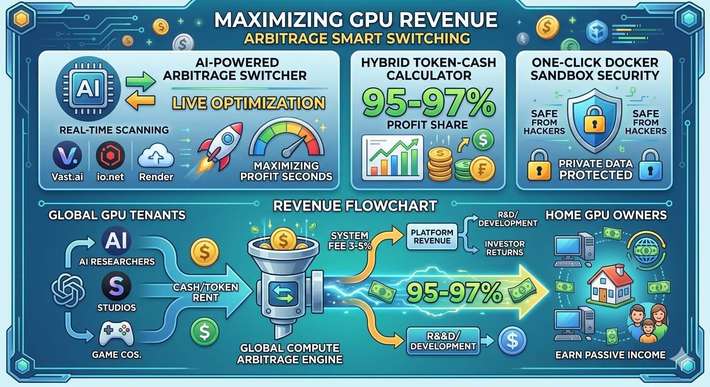

# ⚡ Project: Democratizing Compute — The ASEAN Grid ⚡

> **The Anti-Fragile, Decentralized GPU Yield Optimizer Infrastructure for Southeast Asia.**
> *An Open-Architecture Compute Network Guided by Frontier Computing, Bridging Global AI Demand with Regional Consumer Power via a Prepaid API Matrix.*

---

## 🌎 EXECUTIVE SUMMARY / บทสรุปผู้บริหาร

### 🇺🇸 ENGLISH
In the current era of the **Global Compute Crisis (August 2026)**, centralized Big Tech data centers are hitting severe structural walls—facing massive energy caps, localized climate constraints, and harsh geopolitical chip embargoes. Concurrently, AI giants are experiencing catastrophic server overloads, leaving an immense market gap for immediate, scalable raw processing power.

**"The ASEAN Grid"** is a disruptive, light-asset distributed computing infrastructure that synthesizes fragmented, high-end consumer hardware (RTX 4070 Ti Super / RTX 4090) across Southeast Asia into a unified, low-latency supercomputing monolith. By implementing a highly strategic **Hybrid Monetization Architecture (SaaS Subscription + Prepaid API Key Token Model)**, we capture global enterprise AI inference demand and route fluid cash flows directly back to our network nodes and local communities, entirely bypassing sluggish bureaucratic systems.

### 🇹🇭 ภาษาไทย
ท่ามกลางวิกฤตการณ์ **Global Compute Shortage** (การขาดแคลนพลังประมวลผล AI) และกำแพงภูมิรัฐศาสตร์ครั้งใหญ่ที่สุดในประวัติศาสตร์ที่ทำให้ห้องแล็บ AI ยักษ์ใหญ่ต้อง "ติดหล่มเทคโนโลยี" เนื่องจากระบบคลาวด์ศูนย์กลาง (Centralized) แบกรับภาระไม่ไหวจนเกิดวิกฤตเซิร์ฟเวอร์ล่มข้ามคืน... **เราไม่ได้มาสร้างแอปพลิเคชันทั่วไป แต่เรากำลังสร้าง "โรงไฟฟ้าดิจิทัลกระจายศูนย์แห่งภูมิภาคอาเซียน"**

โครงการนี้จะเปลี่ยนพลังงานที่ซ่อนอยู่ — คือคอมพิวเตอร์สเปกเทพตามบ้านและร้านอินเทอร์เน็ตคาเฟ่นับหมื่นแห่งทั่วเอเชียตะวันออกเฉียงใต้ — ให้กลายเป็นเครือข่ายซูเปอร์คอมพิวเตอร์ขนาดยักษ์ (ASEAN Compute Consortium) เพื่อทำหน้าที่รับส่งและประมวลผลคำสั่ง AI และสตรีมมิ่งความเร็วสูง ผ่านโมเดลธุรกิจที่ฟาดทั้ง 2 ขาคือ **"SaaS Subscription + ระบบเติมเงินล่วงหน้าสไตล์ API Key"** ดึงเม็ดเงินดอลลาร์สด ๆ จากทั่วโลกไหลเข้ากระเป๋าเราตลอด 24 ชั่วโมง โดยไม่ผ่านระบบราชการที่ล่าช้า

---

## 🖼️ THE BLUEPRINT VISUALS (ภาพพิมพ์เขียว — อธิบายด้วยตัวเองได้ทั่วโลก)





---

## 💸 THE DISRUPTIVE HYBRID REVENUE MATRIX (โมเดลธุรกิจฟาด 2 ขา)

Our economic flywheel captures absolute market liquidity by converting target users into **Dual-Role Actors** (acting as both Supply nodes and Demand clients simultaneously within one single software ecosystem):

### 1. B2C: The Subscription Flywheel (รายเดือนมหาชน)

- **Target Demographic:** Harnessing the massive global **350-million registered player base of heavy-duty tactical titles like World of Tanks (WOT)** and high-end home PC owners.
- **The Mechanism:** Users pay a hyper-affordable **$1/Month SaaS subscription** to run our background compiler package. This activates the "Earn While You Sleep" mode, turning their idle gaming setups into micro-generation node factories that yield them automated cash flows while they are asleep, at school, or at work.
- **The Projection:** Converting a conservative 10% of this hyper-targeted demographic unlocks **35,000,000 recurring subscribers**, commanding a monumental **$35,000,000 (1.2+ Billion THB) in Monthly Recurring Revenue (MRR)**.

### 2. B2B: The Prepaid API Key Core (ระบบเติมเงินองค์กรสไตล์ API Key)

- **Target Demographic:** Institutional AI developers, frontier model laboratories, and sovereign tech clusters (e.g., Moonshot AI / Kimi, DeepSeek, and heavy data research centers).
- **The Mechanism:** We eliminate capital-heavy, multi-year fixed Data Center leases. Organizations generate a specialized API Key on our developer platform and load it with upfront capital (Prepaid Cashflow Model). Our engine executes **strict, second-by-second micro-billing (Pay-per-Compute)**, deducting balances *only* when real-time AI workloads are active on our grid. **No computing, zero expenses.**
- **The Geopolitical Arbitrage:** Terrestrial and short-sea optical fiber routing positions the ASEAN region as the definitive proximity haven for East Asian tech giants. We deliver an unprecedented **20-40ms ultra-low latency pipeline**—transferring massive data swarms **5x faster** than high-overhead transpacific Western cloud structures.

---

## ⚙️ TECHNICAL ARCHITECTURE (สถาปัตยกรรมระบบขั้นสูง)

To safeguard our proprietary algorithmic routing and commercial edge from institutional cloning, our repository is strictly partitioned. This repository houses the **Functional Architecture & Spec Sheets**, keeping core routing microservices private.

```
[ GLOBAL AI INFERENCE DEMAND / PREPAID API CLIENTS ]
                    | (20-40ms Low Latency Pipeline)
+-------------------+-------------------+
|                                      |
[ COLD STORAGE RUNS ]      [ LIVE HOT INFERENCE ]
- 3D Rendering (Blender/VFX)   - LLM Query Swarms
- WOT Match Analytics          - Streaming Cloud Gaming
                    |
+-------------------+-------------------+
                    |
[ AI-DRIVEN ARBITRAGE SWITCHER ENGINE ]
                    | (Sub-30s Autonomous Workload Rerouting)
+-----------------------+-----------------------+
|                       |                       |
[ VAST.AI ]        [ IO.NET ]          [ NOUS PSYCHE NET ]
|                       |                       |
+-----------------------+-----------------------+
                    |
[ ONE-CLICK DOCKER SANDBOX ISOLATION ]
                    |
[ HOST COMMUNITY PC / INTERNET CAFE NODE ]
```

### 🛡️ Real-Sector Tokenomics Moat (คูเมืองเหรียญมูลค่าจริง ไม่ใช่ฟองสบู่)

We completely reject speculative, bubble-based web3 metrics. Our native token velocity is driven strictly by **Real-Sector Utility and Corporate Demand**, mirroring the economic growth mechanics of NVIDIA stock:

- **The Staking Deficit:** Home nodes and internet cafe hubs *must* secure and stake a specific volume of tokens to qualify as validated compute nodes, enforcing absolute system uptime and anti-fraud protocols.
- **The Buyback & Burn Flywheel:** A guaranteed **3% - 5% System Fee** harvested from global enterprise prepaid API usage is continuously deployed to auto-buyback tokens from the open market and permanently burn them, creating an aggregate asset appreciation curve backed by real data consumption.

---

## 🤝 ALLIANCE OPEN INVITATION (สาส์นชี้ชวนถึงคนเก่งและนักลงทุน)

### 💻 For Developers: The 5% Treasury Fund (กองทุนล่าหัวกะทิ)

- **The Compass:** Our engineering baseline uses the open-source breakthroughs of **Nous Research (DisTrO & Psyche network frameworks)** as a primary directional compass. We build upon established distributed breakthroughs so you never have to waste months reinventing the wheel.
- **Unrestricted Code Autonomy:** We oppose vendor lock-in. This project is a strict **Open Architecture**. If you can deploy a tighter docker isolation cluster, a faster localized electricity tariff calculation matrix, or a superior arbitrage microservice—**fork this repo, submit a PR, and claim your code ownership.**
- **The Incentive:** An immutable **5% Developer Treasury Pool** coded directly into the framework smart contracts continuously pays out dividends, equity shares, or bounties to engineers maintaining the core grid.

### 💰 For Investors: Hyper-Scalable Asset-Light Infrastructure (ถึงนักลงทุนกระเป๋าหนัก)

- **The Valuation Trajectory:** By leveraging pre-existing, crowdsourced consumer nodes, we eliminate hardware depreciation risks and massive upfront overheads. We are positioning this regional network for a dominant corporate acquisition and a multi-billion baht valuation. We open entry for Angel Visionaries seeking cashflow-backed digital real estate to anchor Phase 1 deployment.

---

## 🛠️ THE IMPLEMENTATION ROADMAP (ขั้นตอนการปฏิบัติจริง)

### Phase 1: The Intellectual Property Lockdown (CURRENT PHASE)
- **Action:** Secure and deploy the global framework layout on GitHub utilizing the **AGPL-3.0 License**. This legally bars multi-billion-dollar institutions from cloning our layout into closed-source proprietary software.
- **Cursor Core Dev:** Initialize the structural telemetry data pipelines (`/backend/data-pipeline`) in Cursor Composer to register local host availability metrics and fleet tracking logic.

### Phase 2: Regional Grid Onboarding
- Deploy the alpha client container across internet cafe hubs in Thailand and Vietnam to stress-test sandbox boundaries under high-throughput rendering loads.

### Phase 3: The Nous Strategic Corridor
- Interface directly with **Nous Research (US)** using our operational regional node proof to lock down a master technology alliance, establishing the primary international advisory channel.

---

### 🚦 Join the Infrastructure Hub

- **Issues:** Flag routing inefficiencies or audit the decentralized transaction distribution loops.
- **Inquiries:** Establish a private encrypted channel with the Founder for secure growth data access.

---

*Licensed under the GNU Affero General Public License v3.0 (AGPL-3.0) — Unauthorized proprietary replication is strictly prohibited.*
