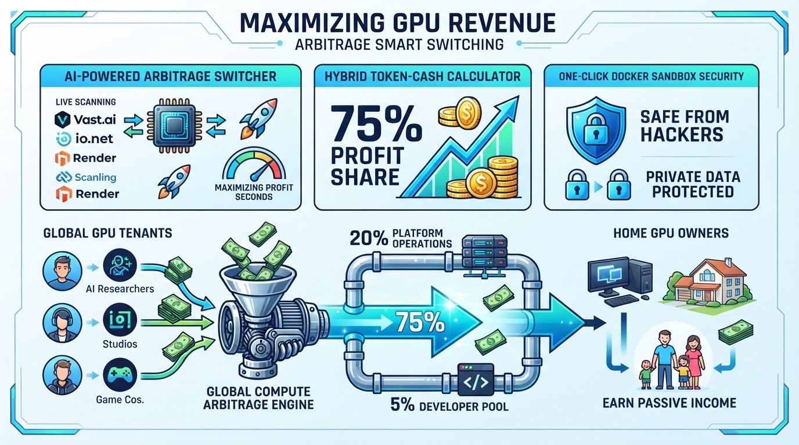
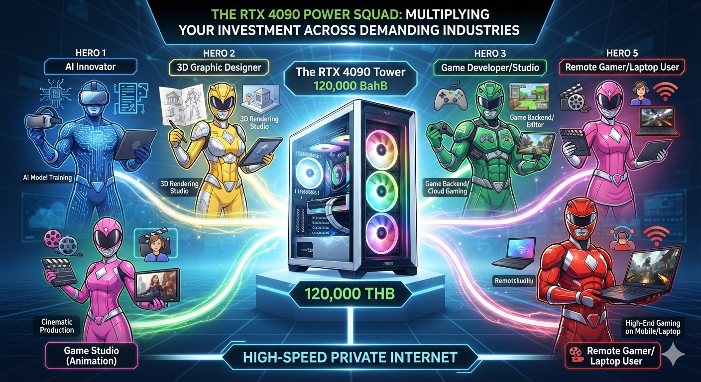
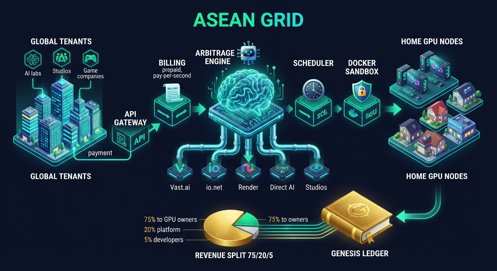
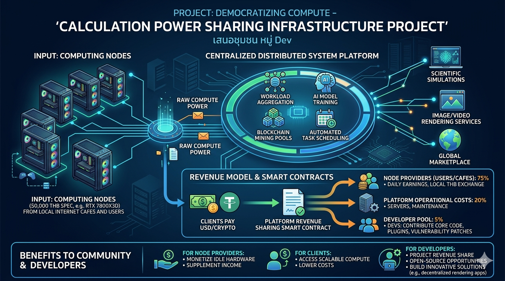
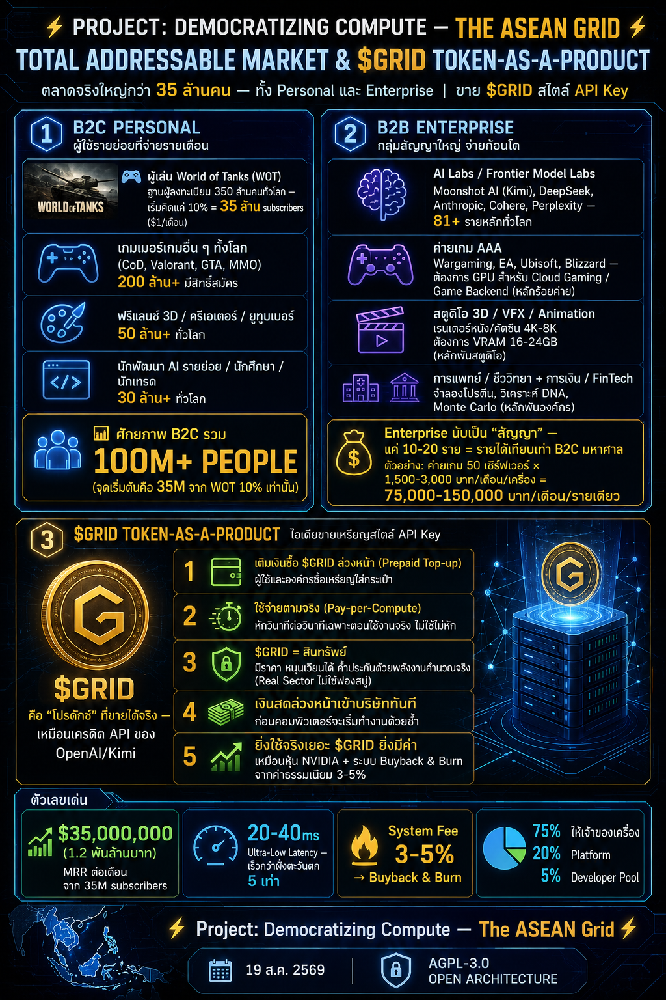

# ⚡ Project: Democratizing Compute — The ASEAN Grid ⚡

> **The Anti-Fragile, Decentralized GPU Yield Optimizer Infrastructure for Southeast Asia.**
> *An Open-Architecture Compute Network Guided by Frontier Computing, Bridging Global AI Demand with Regional Consumer Power via a Prepaid API Matrix.*
>
> **Built on the open-source ethos of Nous Research (DisTrO). Democratizing AI compute across ASEAN.**
> **ยึดมั่นในปรัชญา Open Source แบบ Nous Research (DisTrO) — เปิดโอกาสการประมวลผล AI ให้ทั่วอาเซียน**

> 🌐 **Live Demo:** [GPU Yield Calculator](https://chanan1363.github.io/Asean-compute-yield-optimizer/) — ลองคำนวณรายได้การ์ดจอฟรี / Try the free calculator
> 🧪 **Program Prototype:** [Run the code now](prototype/) — สาธิตระบบจริงด้วยคำสั่งเดียว / one-command live demo (`python prototype/demo.py`)

---

## 🖼️ THE BIG PICTURE (ภาพรวมระบบ — เห็นปุ๊บเข้าใจปั๊บ)



*The full picture: idle SEA gaming GPUs → arbitrage engine → global AI demand → 75/20/5 revenue split back to the community. / ภาพรวมทั้งหมด: GPU ว่างในอาเซียน → สมองจัดสรรงาน → ดีมานด์ AI ทั่วโลก → แบ่งรายได้ 75/20/5 กลับสู่ชุมชน*

---

## 🌎 The Global Compute Crisis Is Here. Southeast Asia Already Has the Answer. / วิกฤตพลังประมวลผลทั้งโลก... คำตอบซ่อนอยู่ในเครื่องเกมของคุณ

### 🇺🇸 ENGLISH
In the current era of the **Global Compute Crisis (August 2026)**, centralized Big Tech data centers are hitting severe structural walls—facing massive energy caps, localized climate constraints, and harsh geopolitical chip embargoes. Concurrently, AI giants are experiencing catastrophic server overloads, leaving an immense market gap for immediate, scalable raw processing power.

**"The ASEAN Grid"** is a disruptive, light-asset distributed computing infrastructure that synthesizes fragmented, high-end consumer hardware (RTX 4070 Ti Super / RTX 4090) across Southeast Asia into a unified, low-latency supercomputing monolith. By implementing a highly strategic **Hybrid Monetization Architecture (SaaS Subscription + Prepaid API Key Token Model)**, we are positioned to capture global enterprise AI inference demand and route fluid cash flows directly back to our network nodes and local communities, entirely bypassing sluggish bureaucratic systems.

### 🇹🇭 ภาษาไทย
ท่ามกลางวิกฤตการณ์ **Global Compute Shortage** (การขาดแคลนพลังประมวลผล AI) และกำแพงภูมิรัฐศาสตร์ครั้งใหญ่ที่สุดในประวัติศาสตร์ที่ทำให้ห้องแล็บ AI ยักษ์ใหญ่ต้อง "ติดหล่มเทคโนโลยี" เนื่องจากระบบคลาวด์ศูนย์กลาง (Centralized) แบกรับภาระไม่ไหวจนเกิดวิกฤตเซิร์ฟเวอร์ล่มข้ามคืน... **เราไม่ได้มาสร้างแอปพลิเคชันทั่วไป แต่เรากำลังสร้าง "โรงไฟฟ้าดิจิทัลกระจายศูนย์แห่งภูมิภาคอาเซียน"**

โครงการนี้จะเปลี่ยนพลังงานที่ซ่อนอยู่ — คือคอมพิวเตอร์สเปกเทพตามบ้านและร้านอินเทอร์เน็ตคาเฟ่นับหมื่นแห่งทั่วเอเชียตะวันออกเฉียงใต้ — ให้กลายเป็นเครือข่ายซูเปอร์คอมพิวเตอร์ขนาดยักษ์ (The ASEAN Grid Consortium) เพื่อทำหน้าที่รับส่งและประมวลผลคำสั่ง AI และสตรีมมิ่งความเร็วสูง ผ่านโมเดลธุรกิจ 2 แกนหลัก (Dual-Revenue Engine) คือ **"SaaS Subscription + ระบบเติมเงินล่วงหน้าสไตล์ API Key"** พร้อมดึงเม็ดเงินดอลลาร์จากทั่วโลกให้ไหลเวียนเข้าสู่เครือข่ายตลอด 24 ชั่วโมง เมื่อเปิดให้บริการเต็มรูปแบบ — ตัดผ่านระบบราชการที่ล่าช้า

---

## 🖼️ THE BLUEPRINT VISUALS (ภาพพิมพ์เขียว — อธิบายด้วยตัวเองได้ทั่วโลก)



*The original idea: one powerful machine (RTX 4090, ~120,000 THB) serving many professions through fast internet — but heavy investment and slow payback led us to keep thinking. / แนวคิดแรกเริ่ม: เครื่องเดียว (RTX 4090, ~120,000 บาท) รับงานหลายอาชีพผ่านเน็ตเร็ว — แต่ลงทุนสูง คืนทุนนาน เลยคิดต่อ*



*The system architecture: global tenants → API gateway & billing → arbitrage engine → scheduler & Docker sandbox → home GPU nodes → Genesis Ledger with 75/20/5 revenue split. / สถาปัตยกรรมระบบ: ลูกค้าโลก → API/บิลลิ่ง → สมอง Arbitrage → จัดคิว & Docker Sandbox → โหนดเครื่องเจ้าของ → Genesis Ledger แบ่งรายได้ 75/20/5*



*The full blueprint: pool idle power from cafes & users → 4 orchestration modules (aggregation, AI training, mining, scheduling) → 3 services (simulations, rendering, marketplace), with smart-contract split 75/20/5. / พิมพ์เขียวเต็มรูปแบบ: รวบรวมพลังว่างจากร้านเน็ต/ผู้ใช้ → 4 โมดูลจัดสรรงาน (รวมงาน/เทรน AI/ขุด/จัดคิว) → 3 บริการ (ซิมูเลชัน/เรนเดอร์/ตลาดโลก) — Smart Contract แบ่งรายได้ 75/20/5 อัตโนมัติ*



*The market & $GRID token overview: B2C 100M+ users, B2B AI labs & studios, prepaid pay-per-compute token model. / ภาพรวมตลาดและโทเคน $GRID: B2C กว่า 100 ล้านคน + B2B ห้องแล็บ AI/สตูดิโอ + โมเดลโทเคนเติมเงินจ่ายตามการใช้งานจริง*

---

## 💸 THE DISRUPTIVE HYBRID REVENUE MATRIX (โมเดลธุรกิจ 2 แกนหลัก — Dual-Revenue Engine)

Our economic flywheel captures market liquidity by converting target users into **Dual-Role Actors** (acting as both Supply nodes and Demand clients simultaneously within one single software ecosystem):

วงล้อเศรษฐกิจของเราดูดซับสภาพคล่องของตลาด โดยเปลี่ยนผู้ใช้ให้เป็น **"นักแสดงสองบทบาท"** — เป็นทั้งผู้ให้พลัง (Supply) และผู้ใช้พลัง (Demand) ในระบบนิเวศเดียวพร้อมกัน:

### 1. B2C: The Subscription Flywheel (รายเดือนมหาชน)

- **Target Demographic:** Harnessing the massive global **350-million registered player base of heavy-duty tactical titles like World of Tanks (WOT)** and high-end home PC owners.
- **The Mechanism:** Users pay a hyper-affordable **$1/Month SaaS subscription** to run our background compiler package. This activates the "Earn While You Sleep" mode, turning their idle gaming setups into micro-generation node factories that yield them automated cash flows while they are asleep, at school, or at work.
- **The Projection:** Converting a conservative 10% of this hyper-targeted demographic could unlock an estimated **35,000,000 recurring subscribers** — a projected **$35,000,000 (1.2+ Billion THB) in Monthly Recurring Revenue (MRR)** at full scale.

- **กลุ่มเป้าหมาย:** ฐานผู้เล่นเกมหนักระดับโลก **350 ล้านคน** (เกม tactical อย่าง World of Tanks) และเจ้าของเครื่อง PC สเปกสูง
- **กลไก:** ผู้ใช้จ่ายสมาชิกเพียง **$1/เดือน** เพื่อรันแพ็กเกจคอมไพล์พื้นหลัง เปิดโหมด **"หารายได้ตอนหลับ" (Earn While You Sleep)** — เปลี่ยนเครื่องเกมที่ว่างให้เป็นโรงงานโหนดขนาดจิ๋ว สร้างรายได้อัตโนมัติตอนหลับ อยู่โรงเรียน หรือที่ทำงาน
- **ประมาณการ (Projection):** แปลงกลุ่มเป้าหมายเพียง 10% จะได้สมาชิกประจำราว **35,000,000 ราย** = รายได้ประจำราว **$35,000,000 (1.2 หมื่นล้านบาท) ต่อเดือน (MRR)** เมื่อถึงขนาดเต็มรูปแบบ

### 2. B2B: The Prepaid API Key Core (ระบบเติมเงินองค์กรสไตล์ API Key)

- **Target Demographic (Phase 1 — immediate):** AI startups and scale-ups, university labs, and local AI application businesses across ASEAN (chatbots, OCR, translation, document processing) that need affordable GPU compute without data-center budgets. **Long-term vision:** frontier model laboratories and sovereign tech clusters (e.g., Moonshot AI / Kimi, DeepSeek) once the network has enterprise-grade SLAs.
- **The Mechanism:** We eliminate capital-heavy, multi-year fixed Data Center leases. Organizations generate a specialized API Key on our developer platform and load it with upfront capital (Prepaid Cashflow Model). Our engine executes **strict, second-by-second micro-billing (Pay-per-Compute)**, deducting balances *only* when real-time AI workloads are active on our grid. **No computing, zero expenses.**
- **The Geopolitical Arbitrage:** Terrestrial and short-sea optical fiber routing positions the ASEAN region as the definitive proximity haven for East Asian tech giants. We deliver an unprecedented **20-40ms ultra-low latency pipeline**—transferring massive data swarms **5x faster** than high-overhead transpacific Western cloud structures.

- **กลุ่มเป้าหมาย (ระยะแรก — เข้าถึงได้ทันที):** สตาร์ทอัพ/บริษัท AI ขนาดเล็ก-กลาง, ห้องแล็บมหาวิทยาลัย, และธุรกิจแอป AI ท้องถิ่นทั่วอาเซียน (แชทบอท, OCR, แปลภาษา, ประมวลเอกสาร) ที่ต้องการพลัง GPU ราคาไม่แพงโดยไม่ต้องลงทุน Data Center **วิสัยทัศน์ระยะยาว:** ห้องแล็บโมเดลระดับแนวหน้าและคลัสเตอร์เทคโนโลยีรายรัฐ (เช่น Moonshot AI / Kimi, DeepSeek) เมื่อเครือข่ายมี SLA ระดับองค์กรแล้ว
- **กลไก:** เราตัดภาระการเช่าดาต้าเซ็นเตอร์ระยะยาวหลายปี องค์กรสร้าง API Key บนแพลตฟอร์มแล้วเติมเงินล่วงหน้า (โมเดลเงินสดล่วงหน้า) — ระบบของเราคิดเงินแบบ **วินาทีต่อวินาที** หักยอดเฉพาะเมื่องาน AI รันจริงบนกริด **ไม่คำนวณ = ไม่จ่าย**
- **จุดได้เปรียบภูมิรัฐศาสตร์:** เส้นใยแสงทางบกและทะเลสั้น ทำให้อาเซียนเป็น "ที่หลบภัยด้านระยะทาง" ของยักษ์ใหญ่เทคโนโลยีเอเชียตะวันออก — latency **20-40ms** ส่งข้อมูลมหาศาล **เร็วกว่าคลาวด์ตะวันตกข้ามแปซิฟิก 5 เท่า**

---

## ⚙️ TECHNICAL ARCHITECTURE (สถาปัตยกรรมระบบขั้นสูง)

To safeguard our proprietary algorithmic routing and commercial edge from institutional cloning, our repository is strictly partitioned. This repository houses the **Functional Architecture & Spec Sheets**, keeping core routing microservices private.

เพื่อปกป้องอัลกอริทึมการจัดเส้นทางและความได้เปรียบทางการค้าจากการลอกเลียนแบบโดยสถาบันใหญ่ โฟลเดอร์ของเราถูกแบ่งส่วนอย่างเคร่งครัด: repo นี้เก็บ **สถาปัตยกรรมเชิงฟังก์ชันและสเปกชีต** ส่วนไมโครเซอร์วิสจัดเส้นทางแกนกลางเก็บเป็นความลับ

```
[ GLOBAL AI INFERENCE DEMAND / PREPAID API CLIENTS ]
                    | (20-40ms Low Latency Pipeline)
+-------------------+-------------------+
|                                      |
[ COLD STORAGE RUNS ]      [ LIVE HOT INFERENCE ]
- 3D Rendering (Blender/VFX)   - LLM Query Swarms
- WOT Match Analytics          - Streaming Cloud Gaming
                    |
+-------------------+-------------------+
                    |
[ AI-DRIVEN ARBITRAGE SWITCHER ENGINE ]
                    | (Sub-30s Autonomous Workload Rerouting)
+-----------------------+-----------------------+
|                       |                       |
[ VAST.AI ]        [ IO.NET ]          [ NOUS PSYCHE NET ]
|                       |                       |
+-----------------------+-----------------------+
                    |
[ ONE-CLICK DOCKER SANDBOX ISOLATION ]
                    |
[ HOST COMMUNITY PC / INTERNET CAFE NODE ]
```

### 🛡️ Real-Sector Tokenomics Moat (คูเมืองเหรียญมูลค่าจริง ไม่ใช่ฟองสบู่)

We completely reject speculative, bubble-based web3 metrics. Our native token — **$GRID (The ASEAN Grid Token)** — has its velocity driven strictly by **Real-Sector Utility and Corporate Demand**, mirroring the economic growth mechanics of NVIDIA stock:

เราปฏิเสธเมตริก web3 แบบเก็งกำไรฟองสบู่โดยสิ้นเชิง โทเคนของเรา — **$GRID** — ถูกขับเคลื่อนด้วย **ประโยชน์ใช้สอยจริงและการดีมานด์ขององค์กร** สะท้อนกลไกการเติบโตทางเศรษฐกิจแบบหุ้น NVIDIA:

- **The Staking Deficit:** Home nodes and internet cafe hubs *must* secure and stake a specific volume of tokens to qualify as validated compute nodes, enforcing absolute system uptime and anti-fraud protocols.
- **The Buyback & Burn Flywheel:** A guaranteed **3% - 5% System Fee** harvested from global enterprise prepaid API usage is continuously deployed to auto-buyback tokens from the open market and permanently burn them, creating an aggregate asset appreciation curve backed by real data consumption.

- **หลักประกัน Staking:** โหนดบ้านและฮับร้านเน็ต *ต้อง* วางหลักประกันโทเคนตามปริมาณที่กำหนด เพื่อรับสิทธิ์เป็นโหนดที่ผ่านการยืนยัน — บังคับความพร้อมใช้งานสูงสุดและป้องกันการโกง
- **วงล้อ Buyback & Burn:** ค่าธรรมเนียมระบบ **3-5%** จากยอดเติมเงิน API ขององค์กรทั่วโลก ถูกนำไปซื้อคืนโทเคนจากตลาดเปิดและเผาทำลายถาวรอัตโนมัติ — สร้างเส้นกราฟมูลค่าทรัพย์สินที่หนุนด้วยการบริโภคข้อมูลจริง

---

## 🤝 ALLIANCE OPEN INVITATION (สาส์นชี้ชวนถึงคนเก่งและนักลงทุน)

### 💻 For Developers: The 5% Treasury Fund (กองทุนล่าหัวกะทิ)

- **The Compass:** Our engineering baseline uses the open-source breakthroughs of **Nous Research (DisTrO & Psyche network frameworks)** as a primary directional compass. We build upon established distributed breakthroughs so you never have to waste months reinventing the wheel.
- **Unrestricted Code Autonomy:** We oppose vendor lock-in. This project is a strict **Open Architecture**. If you can deploy a tighter docker isolation cluster, a faster localized electricity tariff calculation matrix, or a superior arbitrage microservice—**fork this repo, submit a PR, and claim your code ownership.**
- **The Incentive:** A **5% Developer Treasury Pool** — reserved in the blueprint and implemented via the framework smart contracts — is designed to continuously pay out dividends, equity shares, or bounties to engineers maintaining the core grid once payouts go live.

- **เข็มทิศ:** แนวทางวิศวกรรมของเรายึดนวัตกรรมโอเพนซอร์สของ **Nous Research (เฟรมเวิร์ก DisTrO และ Psyche network)** เป็นเข็มทิศหลัก — ต่อยอดจากงานกระจายศูนย์ที่มีอยู่แล้ว ไม่ต้องเสียเดือนๆ ไปล้อวงล้อใหม่
- **อิสระเต็มที่:** เราไม่เอา vendor lock-in โปรเจกต์นี้เป็น **Open Architecture** อย่างเคร่งครัด — ถ้าคุณทำ docker isolation cluster แน่นกว่า คำนวณค่าไฟท้องถิ่นแม่นกว่า หรือ arbitrage microservice ดีกว่า — **fork repo นี้ ส่ง PR แล้วเป็นเจ้าของโค้ดของคุณเอง**
- **สิ่งจูงใจ:** กองทุน **Developer Treasury 5%** ถูกสำรองไว้ในพิมพ์เขียวและจะถูกฝังใน smart contract — ออกแบบให้จ่ายปันผล หุ้น หรือรางวัล ให้วิศวกรที่ดูแลแกนกริดอย่างต่อเนื่อง เมื่อระบบเปิดจ่าย

### 💰 For Investors: Hyper-Scalable Asset-Light Infrastructure (ถึงนักลงทุนกระเป๋าหนัก)

- **The Valuation Trajectory:** By leveraging pre-existing, crowdsourced consumer nodes, we eliminate hardware depreciation risks and massive upfront overheads. We are positioning this regional network for a dominant corporate acquisition and a multi-billion baht valuation. We open entry for Angel Visionaries seeking future cashflow-backed digital real estate to anchor Phase 1 deployment.

- **เส้นทางการประเมินมูลค่า:** ใช้โหนดผู้ใช้แบบ crowdsource ที่มีอยู่แล้ว เราตัดความเสี่ยงค่าเสื่อมฮาร์ดแวร์และภาระต้นทุนเริ่มต้นมหาศาล ตั้งเป้าวางตำแหน่งเครือข่ายระดับภูมิภาคนี้สู่การเข้าซื้อกิจการโดยองค์กรใหญ่ มูลค่าหลายพันล้านบาท เปิดทางให้นักลงทุน Angel ที่มองหา "อสังหาดิจิทัลที่ให้กระแสเงินสดในอนาคต" เพื่อยึดจุดยึดการเปิดตัวเฟส 1

---

## 🛠️ THE IMPLEMENTATION ROADMAP (ขั้นตอนการปฏิบัติจริง)

### Phase 1: The Intellectual Property Lockdown (CURRENT PHASE)
- **Action:** Secure and deploy the global framework layout on GitHub utilizing the **AGPL-3.0 License**. This legally bars multi-billion-dollar institutions from cloning our layout into closed-source proprietary software.
- **Core Dev (stack-agnostic):** Initialize the structural telemetry data pipelines (`/backend/data-pipeline`) to register local host availability metrics and fleet tracking logic — contributors are free to use any architecture or tooling they prefer.

- **การล็อกทรัพย์สินทางปัญญา (เฟสปัจจุบัน):** วางกรอบโครงสร้างระดับโลกบน GitHub ด้วยสัญญา **AGPL-3.0** — ป้องกันสถาบันมูลค่าพันล้านดอลลาร์ลอกกรอบไปทำซอฟต์แวร์ปิดโดยชอบด้วยกฎหมาย
- **Core Dev (อิสระทุกเครื่องมือ):** เริ่มสร้าง data pipeline telemetry (`/backend/data-pipeline`) เพื่อบันทึกเมตริกความพร้อมของโฮสต์และตรรกะติดตามฝูงเครื่อง — นักพัฒนาแต่ละคนเลือกสถาปัตยกรรม/เครื่องมือที่ถนัดได้อิสระ

### Phase 2: Regional Grid Onboarding
- Deploy the alpha client container across internet cafe hubs in Thailand and Vietnam to stress-test sandbox boundaries under high-throughput rendering loads.

- ปล่อย alpha client container ไปยังฮับร้านอินเทอร์เน็ตในไทยและเวียดนาม เพื่อทดสอบขอบเขต sandbox ภายใต้โหลดเรนเดอร์ความจุสูง

### Phase 3: The Nous Strategic Corridor
- Interface directly with **Nous Research (US)** using our operational regional node proof to lock down a master technology alliance, establishing the primary international advisory channel.

- ติดต่อ **Nous Research (US)** โดยตรง พร้อมหลักฐานโหนดภูมิภาคที่ทำงานจริง เพื่อล็อกพันธมิตรเทคโนโลยีระดับแม่บท — สร้างช่องทางที่ปรึกษาระหว่างประเทศหลัก

---

## 🧪 Program Prototype — ลองโค้ดจริง / Run the Code Now

**A working, testable program — not just documents.** / โปรแกรมที่รันได้จริง ไม่ใช่แค่เอกสาร

| วิธี / How | คำสั่ง / Command |
|---|---|
| Full live demo (no install) / สาธิตเต็มระบบ (ไม่ต้องติดตั้ง) | `python prototype/demo.py` |
| Run 16 tests / รันทดสอบ 16 ตัว | `python -m unittest discover -s prototype/tests -v` |
| Customer Portal web UI (needs fastapi/uvicorn) / หน้าเว็บลูกค้า | `pip install fastapi uvicorn && uvicorn prototype.api.app:app` → http://127.0.0.1:8000/ |

**Live data:** Vast.ai channel already pulls real market prices from `console.vast.ai/api/v0/bundles` (60s cache, automatic fallback). / **ข้อมูลสด:** ช่องทาง Vast.ai ดึงราคาตลาดจริงจาก API แล้ว (cache 60 วิ, fallback อัตโนมัติ)

**Extend it:** channel #6, real smart contract, Docker sandbox, your own tuned AI model — all documented in [prototype/README.md](prototype/README.md). / **ต่อยอดได้:** ช่องทางที่ 6, smart contract จริง, Docker sandbox, AI โมเดลจูนของตัวเอง — อ่านคู่มือได้ใน prototype/README.md

---

## 🤝 Contributing — ร่วมพัฒนา

**The ASEAN Grid is open architecture (AGPL-3.0): fork, build, send a PR.** / สถาปัตยกรรมเปิด: fork ได้ แก้ได้ ส่ง PR ได้

- 👨‍💻 **Developers:** read [CONTRIBUTING.md](CONTRIBUTING.md) — fork → branch → test → pull request. Merged PRs qualify for the **5% Developer Pool** per the blueprint.
- 📚 **Lessons from Psyche Network:** [docs/lessons-from-psyche.md](docs/lessons-from-psyche.md) — the 4 real obstacles of internet-scale decentralized training and their proven solutions / บทเรียนจากเครือข่าย Psyche — อุปสรรค 4 ข้อจริงของการเทรนกระจายและวิธีแก้ที่พิสูจน์แล้ว
- 🧠 **Hybrid + Brain Strategy:** [docs/hybrid-brain-strategy.md](docs/hybrid-brain-strategy.md) — why we combine consumer GPUs + small data centers, what SLA means, and why we compete with intelligence not capital / กลยุทธ์ไฮบริด + สมอง — เหตุผลที่ผสม consumer GPU + Data Center เล็ก, SLA คืออะไร, และทำไมเราแข่งด้วยสมองไม่ใช่ทุน
- 🖥️ **Compute Builders:** register your GPU (Google Form in the Genesis Pilot) → get engraved in the Genesis Ledger.
- 📣 **Ambassadors:** share the calculator → climb the Ambassador Board.

---

### 🚦 Join the Infrastructure Hub

- **Issues:** Flag routing inefficiencies or audit the decentralized transaction distribution loops.
- **Inquiries:** Establish a private encrypted channel with the Founder for secure growth data access.

- **Issues:** แจ้งปัญหาประสิทธิภาพการจัดเส้นทาง หรือตรวจสอบลูปกระจายธุรกรรมแบบกระจายศูนย์
- **Inquiries:** สร้างช่องทางเข้ารหัสส่วนตัวกับผู้ก่อตั้ง เพื่อเข้าถึงข้อมูลการเติบโตอย่างปลอดภัย

---

*Licensed under the GNU Affero General Public License v3.0 (AGPL-3.0) — Unauthorized proprietary replication is strictly prohibited.*
